# CS262_project: PPAPD -- P2P Ascending Price Distributed Auction

# Running the Programs

Make sure you have installed the gRPC python package first.  If you haven't, run:

```console
$ python3 -m pip install --upgrade pip
$ python3 -m pip install grpcio
$ python3 -m pip install grpcio-tools
```
(If you encounter problems when installing gRPC, check [their website](https://grpc.io/docs/languages/python/quickstart/).)

The auction system incorportes a user interface supported by PyQt6 package. To install, run:

```console
$ pip install PyQt6
```

Then, download or clone our github repository.  To clone, cd into a folder where you want to put this repository and run: 

```console
$ git clone https://github.com/tao-l/CS262_project.git
```

Then, cd into the repository: 

```console
$ cd CS262_project
```

__To run the servers__, open multiple terminals (and cd into the above directory), in each terminal, run: 

```console
$ python3 server.py id
```

where `id` is a number in `[0, 1, 2, 3, 4]` indicating the id of the server.  (To tolerate 2 faults, we need 5 servers).  You will see something like the following:

```console
  Retrieved!  current_term = 131, voted_for = 0, log_len = 72
  RAFT [1] RPC server starts at 127.0.0.1:30010
  RAFT [1] main loop starts.
 ====== Chat server [1] starts at 127.0.0.1:20010 =======
INFO:root:  RAFT [1] - convert to Candidate from state 0
INFO:root:    RAFT [1], state = [0], last_applied=[0], commit_index=[0], log length = [71], term=[131]
INFO:root:    RAFT [1], state = [0], last_applied=[0], commit_index=[0], log length = [71], term=[138]
```

where [1] is the id of the server. 

The number of servers and their addresses and ports are in `config.py`.  It is now configed for running three local servers. To change the number of servers, add entry to `replicas` list. 

To run the servers across different machines, change the ip addresses and ports in `replicas` list and set `local = False` in `config.py`. 

__Persistence:__ The servers can be run in two modes: persistent or not.  To specify this, change the `need_persistent` in `config.py` to True or False.
In the persistent mode, servers will save states to files `RAFT_records/record0`, `RAFT_records/record1`, etc. 

__To run a client__, run:

```console
$ python3 client.py
```

# Code Structure
Code can be divided into three sections: buyers related, sellers related, platform related, and the shared grpc protocol file. For buyers and sellers related, `client.py` accesses the buyer and the seller, while `auction.proto` defines the rpc service function calls between the buyers and the sellers.
```
+-- client.py
+-- buyer.py
+-- seller.py
``` 
Sellers related files are the following
```
+-- server_state_machine.py
+-- server.py
+-- raft.proto
``` 
The `auction.proto` also contains the rpc service that the server provides.


# Demonstration
To see the capability of the system, we recommend the following three tests 
### Success Trial
This trial demonstrates a successful auction. First open three servers in three terminals using commands
```console
$ python3 server.py 0
$ python3 server.py 1
$ python3 server.py 2
```
The servers will run and successfully select a leader node. 
<p align="center">
  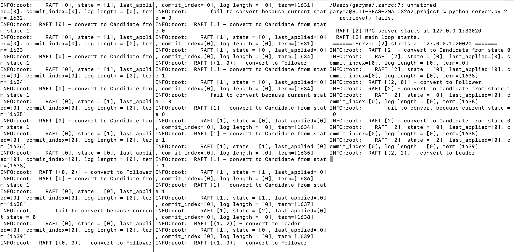
</p>

Then in three different terminals, start one seller and three buyers with the same following command 
```console
$ python3 client.py
```
Buyers and sellers share the same login prompt 
<p align="center">
  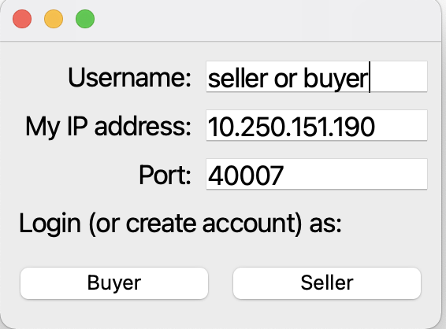
</p>
After the three clients are logged in, the seller can create a new auction by inputting the auction name, item name and item descriptions.  
<p align="center">
  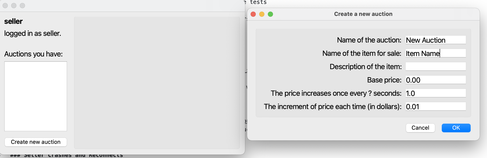
</p>
The new created auction will now appear in all sellers and the buyers' propts 
<p align="center">
  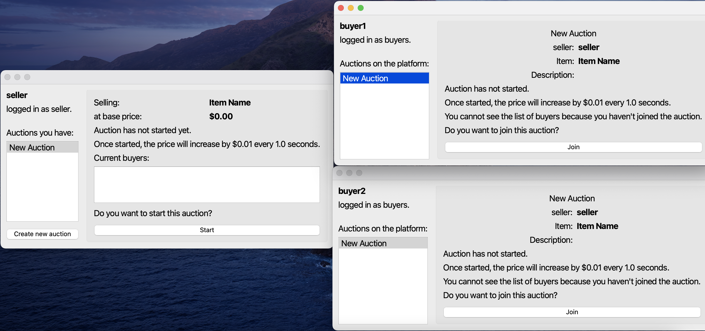
</p>
Buyers can now view the auction and decide to join the auction. If a buyer join, she can view who else has joined the auction and also retains the opportunity to quit. If a buyer does not, she cannot see the detailed information of the auction. The auction owner's view is updated accordingly to who has joined the auction. 
<p align="center">
  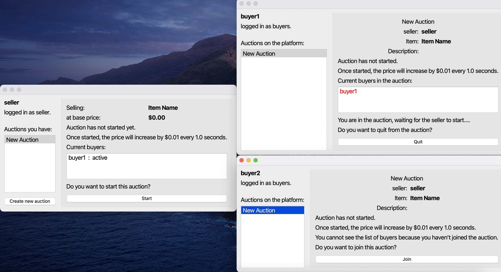
</p>

Now let the other buyer join as well (otherwise the auction will finish automatically because their is only one buyer). The seller can now start the auction and prices begin to increase. Buyers and sellers can see the price increasing continuously in the prompt. 
<p align="center">
  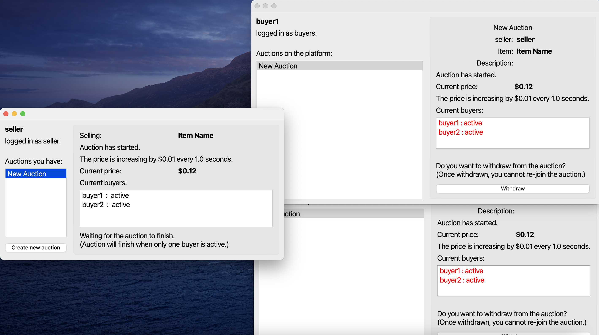
</p>
When a buyer deem the current price is too high, she can click the `withdraw` button and withdraw from the auction. Once withdrawn, this buyer cannot rejoin the auction anymore. In our two buyer example, if one buyer withdraw, there is only one more buyer remaining and the auction will stop. When an auction finishes, all buyers and seller can view the winner, transaction price, and other related info, and the platform is notified of the auction result 
<p align="center">
  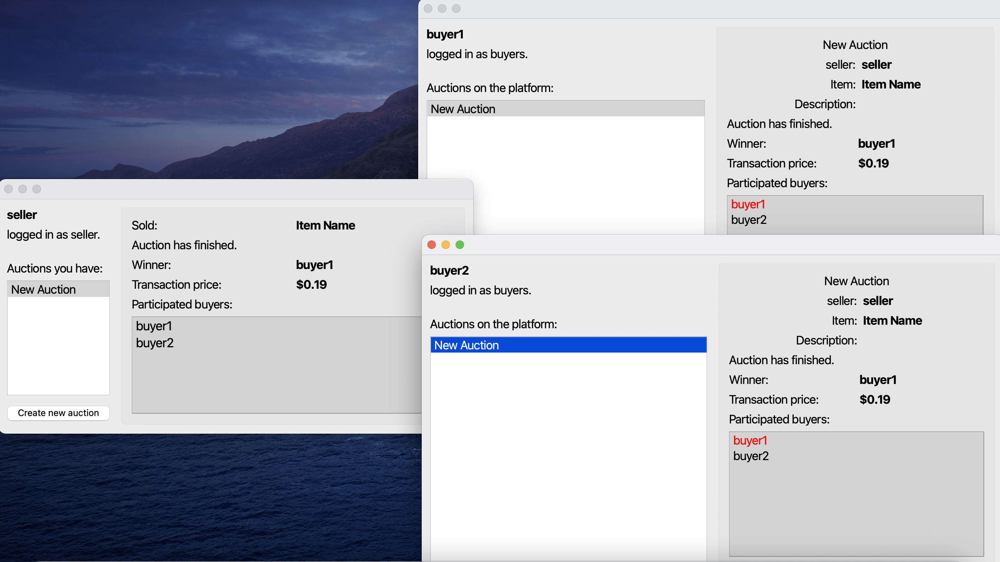
</p>

### Seller Crashes and Reconnects
We now test the redundancy and fault tolerance feature of our system by mimicing a seller crashing in an auction and re-login to resume the auction. Note a buyer crashing in an auction is regarded as the buyer withdrawing from auction. With the same two buyers one seller system, have the seller create another auction and starts the auction. When the seller crashes, on the buyers' prompts the auction is paused 
<p align="center">
  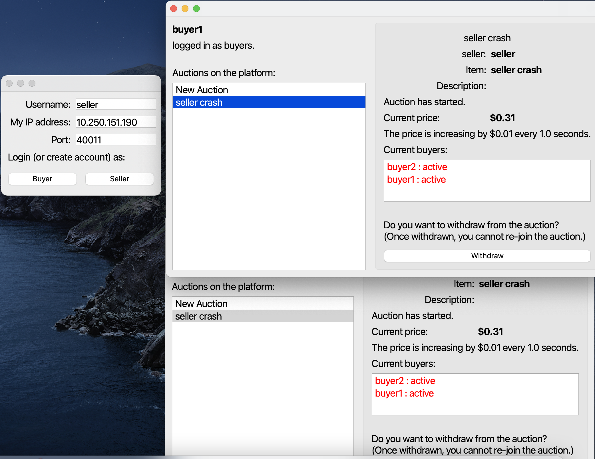
</p>
When the seller relog in, the buyers will receive a notification of the sellers' relogin. 
<p align="center">
  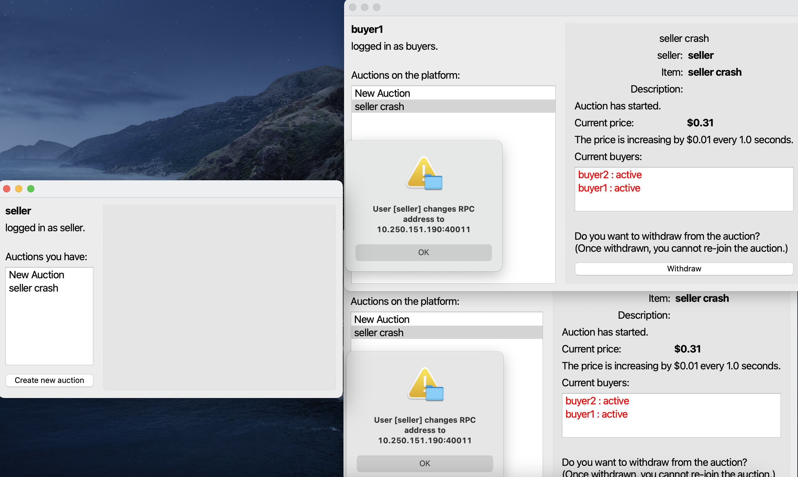
</p>
And finally after the seller relog in, it can choose to resume the previous paused auction. 
<p align="center">
  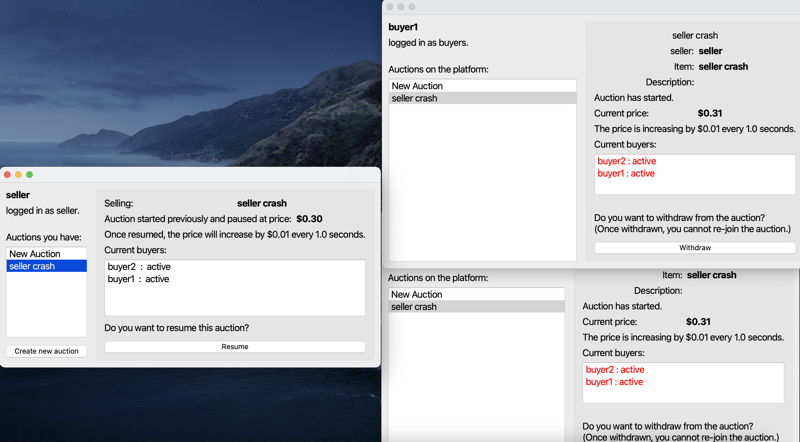
</p>

### Server Crashes and Reconnects
We now test the redundancy and fault tolerance feature of our system by mimicing the entire set of platform servers going down. The sellers and buyers during an auction should all continue to function properly and pick up. Let the seller create a third auction `server fails`, let both buyers join the platform and sellers start the auction. Then force stop all servers in the terminal. The auction will continue between the sellers and buyers as it were.
<p align="center">
  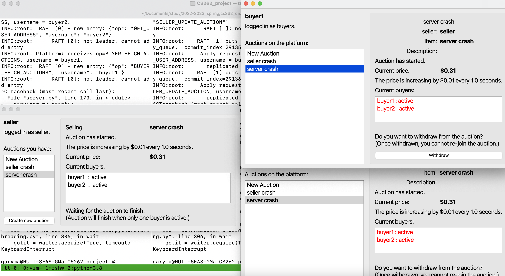
</p>
Then let one buyer withdraw and finish the auction. 
<p align="center">
  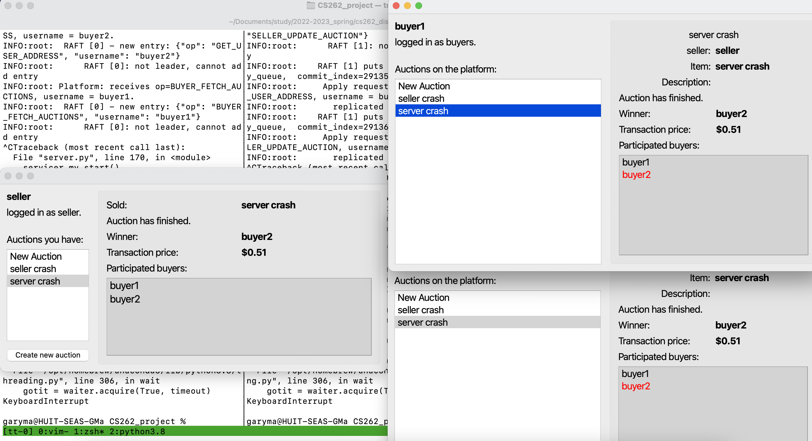
</p>
Finally, restart all servers and start a new buyer. The new buyer is able to see all previous auctions, including the third auction during which all servers crashes. 
<p align="center">
  
</p>
This is realized by seller continuously updating auction info to servers.


# RAFT for fault tolerance and redundancy
A detailed examination of design and modeling choices is given in `final_report.pdf`. The below complements the report, and illustrates the mechanism of the __RAFT__ algorithm implemented on the platform for fault tolerance and redundancy. __RAFT__ related content is in `raft.py`, `server.py`, and 'raft.proto'.

Our approach to replicated chat server is the __replicated state machine__ approach.
Each server maintains a state machine and a log of commands/requests.
Servers take commands/requests from the clients, add the commands to the log, apply the commands to the state machine, and then send responses back to the client. 
The servers use a consensus algorithm to agree on the same sequence of commands.
In particular, we implement the [RAFT algoirhtm](https://raft.github.io/raft.pdf), which was proposed as "an alternative to PAXOS".  This algorithm can tolerate server crashes, network faults and delays, different processing speeds of different servers, etc. 

RAFT is a leader-follower algorithm.  The full algorithm is complicated.  We only give a high-level overview here.  Roughly speaking, the algorithm works as follows: 

1. It works term by term.  At the beginning of each term, a server is elected as a Leader.  Other servers are Followers.

2. Only the Leader can take requests from the client.  After taking a request, the Leader adds the request to its own log.  This request is not committed and cannot be executed immediately.

3. The Leader periodically broadcasts its log to the Followers, asking them to replicate this log.

4. When the Leader learns that a request on the log has been replicated on a majority of all servers, this request is considered committed and the Leader executes this request (namely, applies this command to the state machine) and responds to the client.

5. Followers listen to the Leader's broadcasts, and append new entries to their own logs if the Leader's log has new entries.  If the Leader's log is different from their logs, they replace their logs with the Leader's.  The Leader also tells the Followers which log entries have been committed, and the Followers can execute those entries.

6. If a Follower cannot hear the Leader for some period, the Leader is considered faulty and the Follower starts a new term and runs an election in order to be the new Leader.  To do this, this candidate server requests votes from every other server.  If it receives a majority of votes, then it becomes the Leader.  When deciding whether to vote for a candidate, a server has to compare its own log with the candidate's log and grants vote only if the candidate's log is newer than its log.  This ensures that the Leader always has the "latest" log.  If no Leader can be elected due to split votes, a Follower starts a new election again after some random timeout.  Eventually, some new Leader will be elected.  

We omit many details here.  One can read the [original paper](https://raft.github.io/raft.pdf) or other resources for details.

## Failure Modes We Support
Because we implemented the RAFT algorithm, our server can survive all the failures that RAFT can survice, including: 

1. Crashes: At most a half of the serves crashes.  
2. Network delays and failures:  For example, at most a half of the servers cannot connect to other servers (but can connect to the client); they will not affect the overall system because they are not a majority. 
3. Crashed server can be restarted.  Even after a half of the servers crashing, as long as some servers are restarted so that a half or more servers are running, our system can return to work.
4. Crashed seller and re log in and fetch the previously paused auction from the server. 

### RAFT Server

Each of our server (a `PlatformServiceServicer` object in `server.py`) contains two components:

* a state machine `state_machine` (which is a `ChatStateMachine` object defined in `server_state_machine.py`), and
* a RAFT instance `rf` (which is a `RaftServiceServicer` object defined in `raft.py`).

The server offers RPC services to the client.  When receiving an RPC request from the client, the server asks the RAFT instance (by calling `rf.new_entry(request)`) to add this request to its log.  The RAFT instance will communicate with the RAFT instances on other servers to replicate this request.  The replication is not guaranteed to succeed (e.g., because the current server is not the leader).  When the request is replicated on a majority of servers, this request is considered committed, and the RAFT instance will notify the server to apply this request (by putting the request into the server's `apply_queue`).   Then, the server applies this request to the state machine (calling `state_machine.apply(request)` function) and replies to the client.  If this request is replicated from other servers, do not reply to the client.  The servers never directly communicate with each other -- they communicate via the RAFT instances only. 

The state machine `state_machine` implements the main logic of the chat server.  To facilitate the request passing between different server nodes, a request obejct contain a json string, in which `request.op`, `request.usernames` and other fields are specified. (see `auction.proto` for details).  The `state_machine.apply(request)` function executes this request and returns the response.  The server will then forward this response to the client if needed.

#### Why this design?

Our design completely separates the logic of the consensus/replication algorithm (RAFT) and the logic of the state machine (the specific chat services).
RAFT does not know anything about the state machine and the state machine does not need to worry about replication.  This makes the design more modular and makes all the RAFT code, the state machine code, and the server code re-usable in other problems.  For example, if we want to implement a replicated system for another service, we only need to replace the state machine code without changing the server code and RAFT code. 

### Client

The client does not know which server is the leader, so it just calls all servers one by one until receiving a valid reply (a non-leader server replies with an error message).
Occasionally, all the servers will be unavailable due to, e.g., leader election, in which the client has to deal with errors.  Other details are not very important. 
